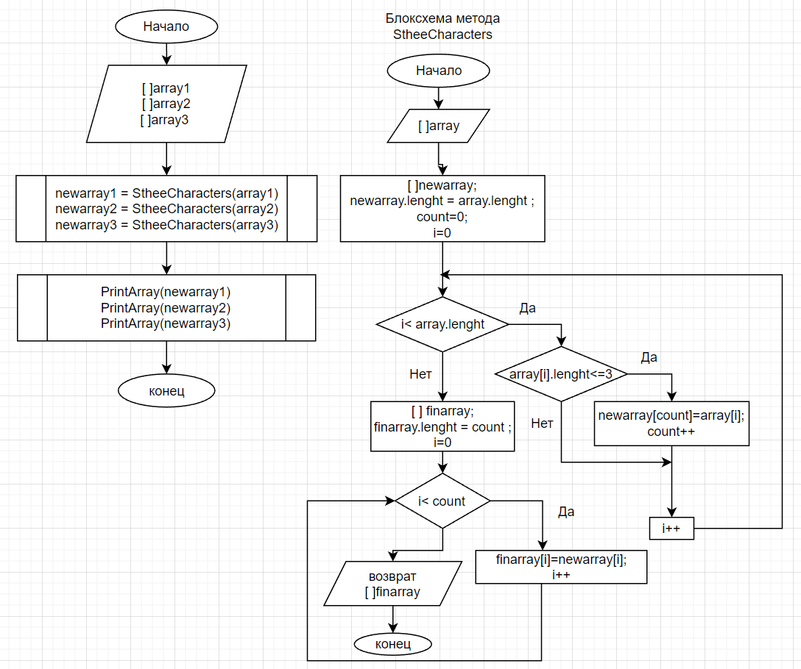

**Итоговая проверочная работа**
* Задание:
* 1. Создать репозиторий на GitHub
* 2. Нарисовать блок-схему алгоритма (можно обойтись блок-схемой основной содержательной части, если вы выделяете её в отдельный метод)
* 3. Снабдить репозиторий оформленным текстовым описанием решения (файл README.md)
* 4. Написать программу, решающую поставленную задачу
* 5. Использовать контроль версий в работе над этим небольшим проектом (не должно быть так, что всё залито одним коммитом, как минимум этапы 2, 3, и 4 должны быть расположены в разных коммитах)
*-Задача: Написать программу, которая из имеющегося массива строк формирует новый массив из строк, длина которых меньше, либо равна 3 символам. Первоначальный массив можно ввести с клавиатуры, либо задать на старте выполнения алгоритма. При решении не рекомендуется пользоваться коллекциями, лучше обойтись исключительно массивами.-*
Примеры:
[“Hello”, “2”, “world”, “:-)”] → [“2”, “:-)”]
[“1234”, “1567”, “-2”, “computer science”] → [“-2”]
[“Russia”, “Denmark”, “Kazan”] → []
* Решение:
блоксхема программы:

* Введем три заданных массива на старте программы.
Поочерёдно передаём заданные массивы методу SthreeСharacters.
* В методе SthreeСharacters в первом цикле 
в массив newarray выбираем элементы длина которых меньше
3х-символов. Под массив newarray мы резервировали длину равную изначально вводимому массиву. Поэтому в хвосте будут не заполненные элементы.с
* В следующем цикле организуем массив finalarray, без пустых элементов в хвосте: строки 16-20.
Далее передаём новые массивы newarray1,newarray 2,newarray3 методу PrintArray.
Метод  PrintArray поэлементно выводит массив на экран.